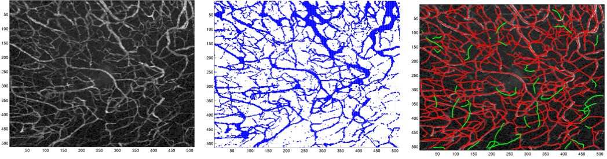
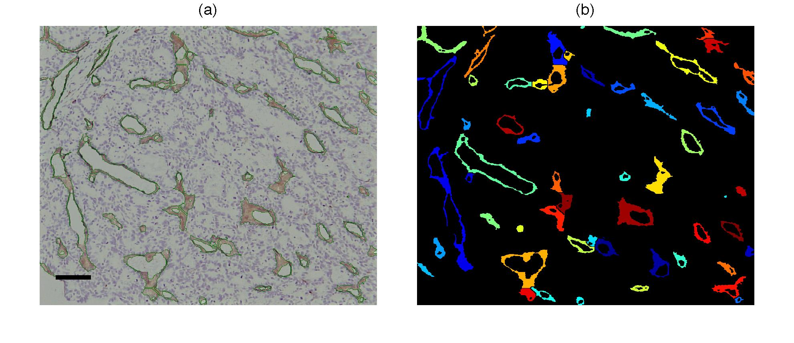

<h2> Circulation and Microcirculation </h2>

I have worked with experiments that investigate the circulation of cells at a microscopic level looking at cells as they move through vasculature and also at a macroscopic level analysing vascular function and vascular shapes.




